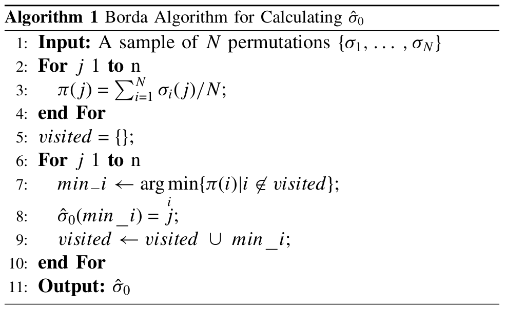

# Estimation of Distribution Algorithm with Mallows Distribution on Traveling Salesman Problem

- [Estimation of Distribution Algorithm with Mallows Distribution on Traveling Salesman Problem](#estimation-of-distribution-algorithm-with-mallows-distribution-on-traveling-salesman-problem)
  - [Rozpatrywane zagadnienie](#rozpatrywane-zagadnienie)
  - [Definicja problemu](#definicja-problemu)
  - [Użyta metoda](#użyta-metoda)
    - [Rozkład Mallowsa](#rozkład-mallowsa)
    - [Metryka Kendall-$\\tau$](#metryka-kendall-tau)
    - [Próbkowanie rozkładu](#próbkowanie-rozkładu)
      - [Pseudokod](#pseudokod)
    - [Estymowanie parametrów rozkładu za pomocą próbki](#estymowanie-parametrów-rozkładu-za-pomocą-próbki)
      - [Estymacja permutacji centralnej](#estymacja-permutacji-centralnej)
      - [Estymacja parametru rozrzutu](#estymacja-parametru-rozrzutu)
  - [Implementacja](#implementacja)
  - [Wyniki](#wyniki)
  - [Podsumowanie](#podsumowanie)
    - [Wnioski końcowe](#wnioski-końcowe)
    - [Podsumowanie](#podsumowanie-1)
    - [Perspektywy rozwoju](#perspektywy-rozwoju)

## Rozpatrywane zagadnienie

W tym projekcie rozpatrywany jest klasyczny problem komiwojażera. Mając dany graf pełny nieskierowany, szukamy minimalnego cyklu Hamiltona.

## Definicja problemu

* $N \in \mathbb{N}_+$ - liczba wierzchołków w grafie
* $D \in \mathcal{M}_{N \times N}(\mathbb{R}_+ \cup \{ 0 \})$ - symetryczna macierz odległości między wierzchołkami w grafie
* $\Omega = \{ a_i \}_{0 \leq i \leq N-1}$, gdzie $a_i \in \{ 0, 1, \ldots, N-1\}$ oraz dla $i \neq j$ zachodzi $a_i \neq a_j$. Zauważmy, że jest to przestrzeń permutacji zbioru $N$-elementowego.
* $F: \Omega \rightarrow \mathbb{R}_+ \cup \{0\}$ - funkcja celu, którą minimalizujemy 
  $$F(\{a_i\}) = \sum_{i=0}^{N-1} D_{a_i, a_{i+1}}$$
  gdzie $a_N = a_0$.

W użytej przez nas implementacji ustalamy, że ciąg elementów, którego szukamy, zaczyna się w wierzchołu $0$. Ze względu na to, że poszukujemy cyklu, możemy poczynić takie założenie bez straty ogólności. Po opisanym przeformułowaniu problem wygląda następująco.

* $\Omega = \{ a_i \}_{0 \leq i \leq N-2}$, gdzie $a_i \in \{ 0, 1, \ldots, N-2\}$ oraz dla $i \neq j$ zachodzi $a_i \neq a_j$
* $F: \Omega \rightarrow \mathbb{R}_+ \cup \{0\}$ - funkcja celu, którą minimalizujemy 
  $$F(\{a_i\}) = D_{0, a_1} + \sum_{i=1}^{N-1} D_{a_i, a_{i+1}}$$
  gdzie $a_N = 0$.

## Użyta metoda

Wykorzystujemy algorytm EDA, zatem potrzebny jest rozkład zdefiniowany na przestrzeni permutacji.

### Rozkład Mallowsa

Rozkład Mallowsa próbuje naśladować rozkład normalny na przestrzeni permutacji. Wobec tego posiadamy permutację centralną ($\sigma_0$) (średnią) oraz parametr rozrzutu ($\theta$) (wariancję). Dla danej permutacji $\sigma$ definiujemy jej prawdopodobieństwo jako
$$ P(\sigma) = \frac{1}{\phi(\theta)}e^{-\theta d(\sigma, \sigma_0)},$$
gdzie $\phi(\theta)$ jest stałą normalizcującą a $d$ wybraną metryką.

### Metryka Kendall-$\tau$

Dla dwóch permutacji $\sigma_1$, $\sigma_2$ zbioru $n$-elementowego definiujemy odległośc między nimi jako liczbę transpozycji sąsiadujących ze sobą elementów, która jest potrzebno do uzyskania jednej permutacji z drugiej. Inaczej, to liczba par argumentów, których wartości zwracane są przez dwie permutacje w odwrotnej kolejności. Formalnie,
$$\tau(\sigma_1, \sigma_2) = | \{ (i,j) \, | \, i<j,(\sigma_1(i) < \sigma_1(j) \land \sigma_2(i) > \sigma_2(j)) \lor (\sigma_2(i) < \sigma_2(j) \land \sigma_1(i) > \sigma_1(j)) \}$$
Powyższy wzór można zapisać w innej postaci i z takowej będziemy korzystać do obliczeń. Po pierwsze, metryka Kendall-$\tau$ jest prawo-niezmiennicza. Zatem,
$$\tau(\sigma_1, \sigma_2) = \tau(\sigma_1 \sigma_2^{-1}, e).$$
Niech $\pi = \sigma_1 \sigma_2^{-1}$. Wtedy,
$$ \tau(\sigma_1, \sigma_2) = \sum_{j=0}^{N-2} V_j(\pi),$$
gdzie
$$V_j = \sum_{i=j+1}^{N-1} I[\pi(j) > \pi(i)] = |\{ i \, | \, i > j \land \pi(i) < \pi(j) \} |.$$
Tutaj dokonać można ważnej obserwacji - mianowicie wartości $V_j$ jednoznacznie definiują permutację $\pi$.

### Próbkowanie rozkładu

Do generowanie próbek z rozkładu Mallowsa posłużą zmienne $V_j$. Zauważmy, że $V_j$ przyjmuje wartości ze zbioru $\{0, \ldots, n-j-1\}$. Zachodzi,
$$P(V_j(\pi) = r_j) = \frac{\exp(-\theta r_j)}{\psi_j(\theta)}$$
dla
$$\psi_j(\theta) = \frac{1-e^{-(N-j)\theta}}{1- e^{-\theta}}$$
oraz $r_j \in \{0, \ldots, n-j-1\}$.

Powyższe fakty prowadzą prosto do implementacji próbkowania. Losujemy wartości zmiennych losowych $V_j$ i odtwarzamy na ich podstawie permutację $\pi$, którą składamy później z permutacją centralną $\sigma_0$.

#### Pseudokod

1. i = 0
2. lista = [0,1,2,..., N-1]
3. pi = []
4. pi.append($V_i$)
5. del lista[$V_i$]
6. if i == N-1, permutacja.append(lista[0]), return pi
7. i = i+1
8. go to 4.

### Estymowanie parametrów rozkładu za pomocą próbki

Podczas egzekucji algorytmu EDA potrzebna jest umiejętność estymowania permutacji centralnej oraz rorzutu.

Przystępujemy do tego w dwóch krokach. Najpierw estymujemy permutację centralną a następnie parametr rozrzutu.

#### Estymacja permutacji centralnej

Okazuje się, że znalezienie permutacji centralnej jest problemem $NP$-zupełnym, dlatego rozwiążemy ten problem przy użyciu algorytmu Borda.

Intuicyjnie: obliczamy średnią wartość dla danego argumentu. Następnie sortujemy otrzymane średnie.

#### Estymacja parametru rozrzutu

Niech $\bar{V}_j = \frac{1}{M} \sum_{i=1}^M V_j(\sigma_i, \sigma_0^{-1})$. Zachodzi równość
$$\sum_{j=0}^{N-2}\bar{V}_j = \frac{N-1}{e^\theta-1} - \sum_{j=0}^{N-2}\frac{N-j}{e^{(n-j)\theta} - 1}.$$

Uzyskujemy parametr rozrzutu poprzez rozwiązanie powyższego równania metodą Newtona.

## Implementacja

## Wyniki

## Podsumowanie

### Wnioski końcowe

### Podsumowanie

### Perspektywy rozwoju